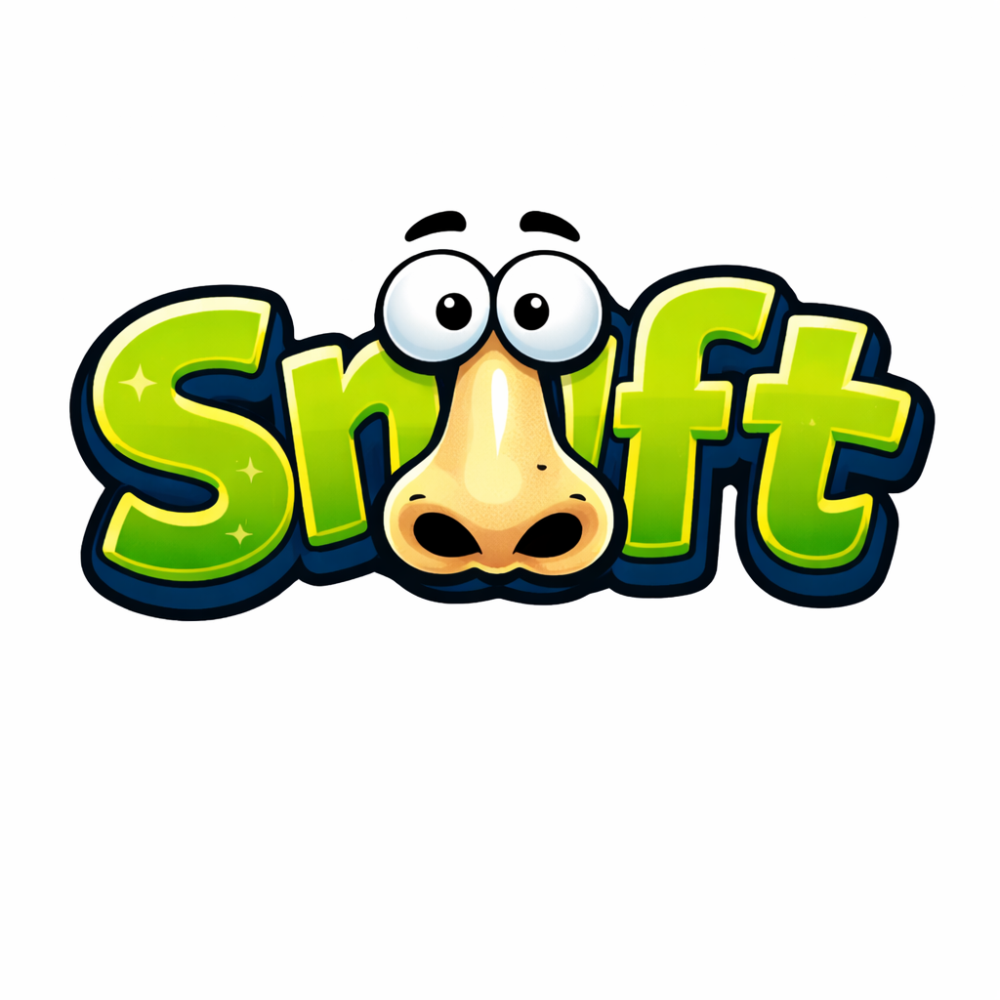

# Snyft

<p align="center">
  
</p>

<p align="center"><em>Does it pass the snyft test?</em></p>

**Snyft** is a supply chain security analyzer that evaluates dependencies from Python, JavaScript, and Java projects using a **20-point risk scoring system** across 10 categories to identify potential compromise risks.

Unlike vulnerability scanners focused on CVEs, Snyft assesses the **likelihood of supply chain compromise** by analyzing repository metadata, build practices, source code availability, and security signals.

## Installation

### Using Go Install (Recommended)

```bash
go install github.com/metalstormbass/snyft@latest
export PATH=${PATH}:`go env GOPATH`/bin
```

If it is your first time using `go` to install packages, you'll need to run the second line in the snippet above.

### Build from Source

Requires Go 1.24+.

```bash
git clone https://github.com/metalstormbass/snyft.git
cd snyft
make build
```

## Usage

```bash
./snyft scan                              # Scan current directory
./snyft scan /path/to/project             # Scan specific directory
./snyft scan -v                           # Detailed output with findings
./snyft scan --format json -o results.json  # JSON output to file
./snyft scan --format markdown -o SECURITY.md
./snyft scan --format html -o report.html
./snyft scan --workers 20                 # Increase concurrency
```

If you installed snyft via `go`, you can run commands without the `./` part. Running a scan of your current directory would be done via `snyft scan`.

> **Note:** Scanning projects with many dependencies may take several minutes. Running multiple scans concurrently may trigger GitHub rate limits (60 requests/hour unauthenticated, 5,000/hour with `GITHUB_TOKEN`).

### Dependency Deduplication

When a project references the same package at multiple versions across different manifest files, snyft **deduplicates by name and keeps the most recent version** by default. This avoids redundant scans for the same library.

To scan every version individually, use the `--all-versions` flag:

```bash
snyft scan --all-versions
```

### Options

| Flag | Description | Default |
|------|-------------|---------|
| `-f, --format` | Output format: `text`, `markdown`, `json`, `html` | `text` |
| `-w, --workers` | Concurrent workers | 10 |
| `-v, --verbose` | Detailed output with findings and evidence | `false` |
| `-o, --output` | Write results to file | stdout |
| `--include-transitive` | Analyze transitive dependencies | `false` |
| `--all-versions` | Scan all versions of duplicate dependencies (skip deduplication) | `false` |
| `--check` | Run only specific checks (comma-separated) | all checks |

Valid check names: `publisher-control`, `ownership-changes`, `release-anomalies`, `install-execution`, `dependency-sprawl`, `provenance`, `health`, `governance`, `release-security`, `package-maturity`

```bash
snyft scan --check health,provenance,governance
```

## Supply Chain Scoring System

Each dependency is scored across 10 categories (0-2 risk points each):

| Category | Risk Indicators |
|----------|----------------|
| **1. Publisher Control** | Single maintainer, no signing, no 2FA |
| **2. Ownership Changes** | Recent maintainer changes |
| **3. Release Anomalies** | Long dormancy followed by sudden release |
| **4. Install Execution** | postinstall scripts, dangerous patterns |
| **5. Dependency Sprawl** | Many transitive dependencies (50+) |
| **6. Provenance** | No source verification, unsigned releases, missing build provenance |
| **7. Health** | Low bus factor, no review oversight |
| **8. Governance** | No SECURITY.md, slow issue response, no documented release process |
| **9. Release Security** | Manual publishing, no branch protection, insecure CI config, undocumented release process |
| **10. Package Maturity** | New/abandoned package, irregular updates |

**Total Score**: 0-20 points
- **0-8**: Low risk
- **9-12**: Medium risk
- **13+**: High risk

## Supported Ecosystems

| Ecosystem | Manifest Files |
|-----------|---------------|
| **JavaScript/Node.js** | package.json, package-lock.json, yarn.lock |
| **Python** | requirements.txt, Pipfile, Pipfile.lock, pyproject.toml, setup.py |
| **Java/Maven** | pom.xml, build.gradle |

## Multi-Platform Support

Repository analysis works across:
- **GitHub**, **GitLab**, **Bitbucket** (auto-detected from URLs)
- Works out of the box with zero configuration — web scraping is the primary data source
- Optional API tokens (`GITHUB_TOKEN`, `GITLAB_TOKEN`, `BITBUCKET_TOKEN`) for richer data and higher rate limits

## Rate Limits

Snyft works without authentication, but GitHub limits unauthenticated requests to **60/hour**. For large projects, set a token for **5,000 requests/hour**:

```bash
export GITHUB_TOKEN="ghp_..."
```

| | Unauthenticated | With `GITHUB_TOKEN` |
|---|---|---|
| **GitHub API** | 60 req/hour | 5,000 req/hour |
| **npm/PyPI/Maven** | No strict limits | - |

The token is **optional** — snyft uses web scraping as the primary data source. The token supplements scraping with richer GitHub data and higher rate limits.

## License

MIT License - see LICENSE file for details.
